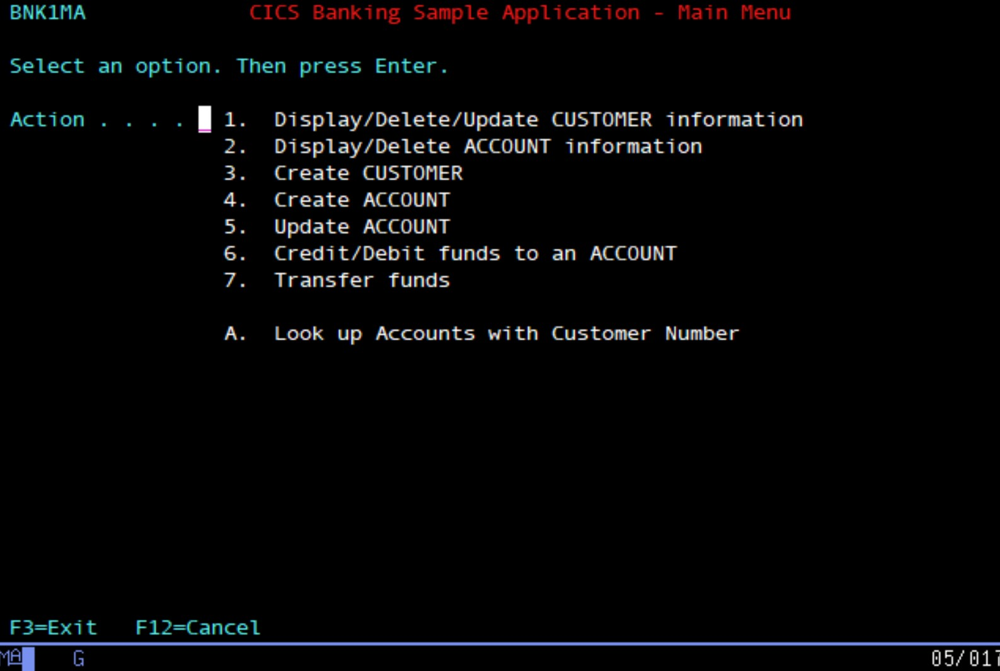
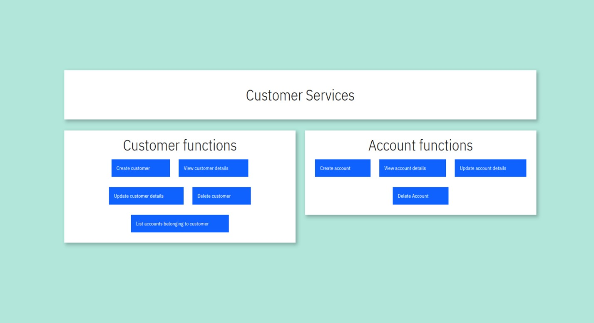
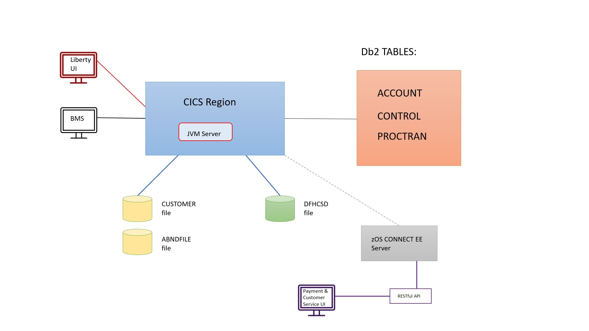

# cics-banking-sample-application-cbsa
The **C**ICS **B**ank **S**ample **A**pplication (CBSA) is an application which simulates the operation of a bank, from the point of view of the Bank Teller. CBSA has multiple uses 
here are a few examples:
  - CBSA can be used as a teaching/learning aid, as all source code is provided. It demonstrates how various technologies can be integrated together; CICS, COBOL, BMS, Db2, SQL, Java, Liberty, Spring Boot etc. 
  - CBSA provides an example of a traditionally written CICS application that has been extended over time, and is structured in a way that is recognisable to most CICS TS customers - so 
    it can be used a conversation piece for discussions around the application development lifecycle.
  - CBSA can be used straight out of the box for testing purposes. For example: the testing of CICS interactions, or for testing verification/validation/interaction of IBM and vendor tool offerings.
  - CBSA can be used as the building block for application modernisation conversations.

## Table of Contents

- [About](#about)
- [Architecture](#architecture)
- [Requirements](#requirements)
- [Downloading](#downloading)
- [Installing](#installing)
- [Usage](#usage)
- [Contributors](#contributors)

## About
There are multiple different interfaces exploiting a range of different underlying technologies.

The first interface is the **base COBOL (BMS) interface**:
>
 

The second interface is the **Carbon React UI interface**:
> 
 

The third interface is the **Customer Services interface**:
> 
 

The fourth interface is the **Payment interface**:
> 
 

There is also a **RESTful API** please refer to the [CBSA RESTful API Guide](https://github.com/cicsdev/cics-banking-sample-application-cbsa/tree/main/etc/usage/springBoot/doc/CBSA_Restful_API_guide.md) for more detailed information.
 

The interfaces are designed to exploit the underlying banking functionality, which includes functions to:
> - Pay money in
> - Take money out
> - Transfer funds
> - Open new accounts etc. etc.

## Architecture

> Please refer to the [Architecture documentation](https://github.com/cicsdev/cics-banking-sample-application-cbsa/tree/main/doc/CBSA_Architecture_guide.md) for more detailed information.

## Requirements
- An existing CICS TS region running at V6.1 or later
- A Db2 subsystem (V12 or later)
- A Liberty JVM server in CICS (set up and configured during the installation process) for the Liberty UI and Spring Boot interfaces
- Java 17
- Apache Maven on the workstation (to build the Liberty UI, Customer Services and Payment interfaces)
- Yarn to build the web front-end
- Various VSAM files (set up and configured during the installation process)
- A z/OS Connect server (if the RESTful API or the Customer Services or Payment interfaces are required)

## Downloading
- Clone the repository using your IDEs support, such as the Eclipse Git plugin
- **or**, download the sample as a [ZIP] from the release page and then follow the installation instructions (see Installing).

>*Tip: Eclipse Git provides an 'Import existing Projects' check-box when cloning a repository.*

These instructions will get you a copy of the project up and running on your local machine for development and testing purposes.

## Installing
Installation instructions:
 

Installation of CBSA is split into 3 parts :
  1. The base COBOL(BMS) installation, this is mandatory and should be installed first. See the [base COBOL installation documentation.](https://github.com/cicsdev/cics-banking-sample-application-cbsa/tree/main/etc/install/base/doc/CBSA_base_cobol_installation_instructions.md) 
  2. The Liberty UI installation, this is optional, requires a JVM server to be running in the CICS region (this gets set up as part of installation process). See [the Liberty UI installation documentation.](https://github.com/cicsdev/cics-banking-sample-application-cbsa/tree/main/etc/install/libertyUI/doc/CBSA_Liberty_UI_installation_deployment_guide.md)
  3. The Customer Service and Payment interface installation (also optional). See [deploying the Payment and Customer Services documentation.](https://github.com/cicsdev/cics-banking-sample-application-cbsa/tree/main/etc/install/springBootUI/doc/CBSA_Deploying_the_Payment_Customer_Services_Springboot_apps.md)

## Usage
Various user guides are provided:

  1. For the base/COBOL(BMS) interface please refer to the [CBSA BMS User Guide.](https://github.com/cicsdev/cics-banking-sample-application-cbsa/tree/main/etc/usage/base/doc/CBSA_BMS_User_Guide.md)
  2. For the Liberty UI please refer to the [CBSA Liberty UI User Guide.](https://github.com/cicsdev/cics-banking-sample-application-cbsa/tree/main/etc/usage/libertyUI/doc/CBSA_Liberty_UI_User_Guide.md)
  3. For the Customer Services interface please refer to the [CBSA Customer Service User Interface User Guide.](https://github.com/cicsdev/cics-banking-sample-application-cbsa/tree/main/etc/usage/springBoot/doc/CBSA_Customer_Services_Interface_User_Guide.md)
  4. For the Payment interface please refer to the [CBSA Payment Interface User Guide.](https://github.com/cicsdev/cics-banking-sample-application-cbsa/tree/main/etc/usage/springBoot/doc/CBSA_Payment_Interface_User_Guide.md)
  5. For the RESTful API guide please refer to the [CBSA RESTful Api Guide.](https://github.com/cicsdev/cics-banking-sample-application-cbsa/tree/main/etc/usage/springBoot/doc/CBSA_Restful_API_guide.md)

## Contributors
 > Jon Collett - JonCollettIBM
 >
 > James O'Grady - JAMOGRAD
 > 
 > Tom Slattery - Tom-Slattery
 > 
 > Christopher Clash - ChristopherClash

## License
This project is licensed under [Eclipse Public License - v 2.0](LICENSE). 
