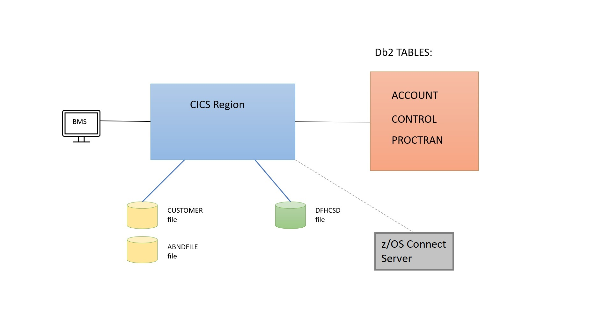
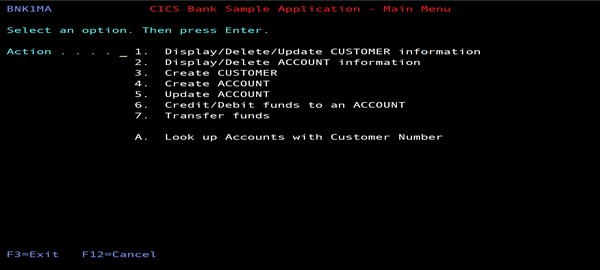
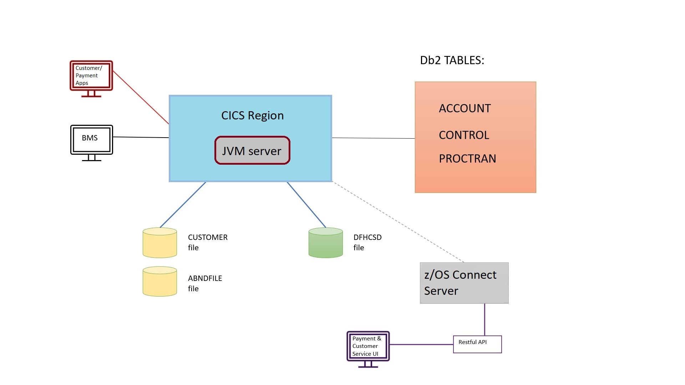

# CICS Banking Sample Application (CBSA) Architecture

## Introduction:

There are multiple parts to the CICS Banking Sample Application (CBSA).
There is:

-   The base/COBOL installation - which needs to be installed first.

-   The Carbon React Interface - which builds upon the base/COBOL
    installation.

-   The Payment/Customer Services User Interfaces - these too build
    upon the base/COBOL interface.

The Carbon React and the Payment/Customer Services UIs are distinct
interfaces separate from each other. These can be installed later if
required, both execute in a Liberty JVM inside of the CICS region.
However, to get all of the features and the full functionality of CBSA
we strongly recommend installing all three parts.

## CBSA base/COBOL installation architecture diagram: 

This is the minimum installation required to get CBSA up and running.
The architecture diagram for base/COBOL looks as follows:

### Assumptions & Requirements for base/COBOL:

The base/COBOL installation assumes that the installer has:

-   A CICS region (running CICS TS 5.4 or greater)

-   A Db2 subsystem (v12 or greater)

-   A zOS Connect server

For the CBSA base offering the CICS region does not need to have a JVM
server, although for additional/optional CBSA installation offerings
e.g. the Carbon React UI and the Payment/Customer Service UIs a JVM will be
required. The base/COBOL installation utilises BMS maps:

All CBSA resource definitions for the CBSA base offering are supplied
via the CICS region's DFHCSD file - installation jobs are provided to
update this file.

The data utilised by CBSA is spread over a mixture of Db2 tables and
VSAM files. For example, the Account information is held on a Db2 table
called ACCOUNT, internal control information for CBSA is held on the
CONTROL table and the PROCTRAN table (Process Transactions) holds all
successfully processed banking transactions. All of these tables get set
up and populated during base CBSA installation.

There are a couple of VSAM files utilise within CBSA. The first is the
CUSTOMER file which holds CUSTOMER information, and the second file an
internal file call ABNDFILE, which is used for abend processing. These
files are defined and populated (where applicable) during installation
too.

Please note that whilst the zOS Connect EE server is setup during the
base/COBOL installation, it only gets utilised for RESTful API calls and
by the Payment and Customer Services interfaces.

For more information please refer to:

> [COBOL Installation Documentation](/etc/install/base/doc/CBSA_base_cobol_installation_instructions.md)

for the base/COBOL installation documentation.

## The Carbon React UI installation architecture diagram:

The diagram below shows the addition of the Carbon React UI. This utilises a
JVM server running in the CICS region.

### Assumptions & Requirements for the Carbon React UI: 

The Carbon React User interface assumes:

-   That the base/COBOL installation has already been successfully
    installed.

-   That there is a Liberty JVM server executing in the CICS region

-   Java 11

For more information please refer to:

> [Carbon React Documentation and Installation Guide](/etc/install/carbonReactUI/doc/CBSA_Carbon_React_UI_installation_deployment_guide.md)

## The Payment and Customer Services (Spring Boot) User Interface installation architecture diagram:

The diagram below shows the addition of the Spring Boot Payment and
Customer Services user interfaces. These utilise the RESTful APIs which
interface with a zOS Connect EE server and from there talk to the CICS
region.

## Assumptions & Requirements for the Payment and Customer UIs: 

The Payment and Customer Services UI assumes:

-   That the base/COBOL installation has been successfully completed

-   That there is a Liberty JVM (installed as part of the Carbon React UI installation)

-   That there is a zOS Connect server (installed as part of the base installation)

-   Java 11

If you wish to utilise the RESTful API via the Spring Boot Payment or
Customer services UI or from a web browser, you will need a zOS Connect
EE server. The installation instructions for the zOS Connect EE Server
are included in the base/COBOL CBSA documentation please refer to:

> [Base COBOL Documentation](/etc/install/base/doc/CBSA_base_cobol_installation_instructions.md)

For more information about installing the Payment and Customer Services
UI (Spring Boot) please refer to:

> [Springboot Installation Instructions](/etc/install/springBootUI/doc/CBSA_Deploying_the_Payment_Customer_Services_Springboot_apps.md)

For the Customer Services and Payment user guides, and the RESTful API guide:

> [Springboot Documentation](/etc/usage/sprintBoot/doc)

