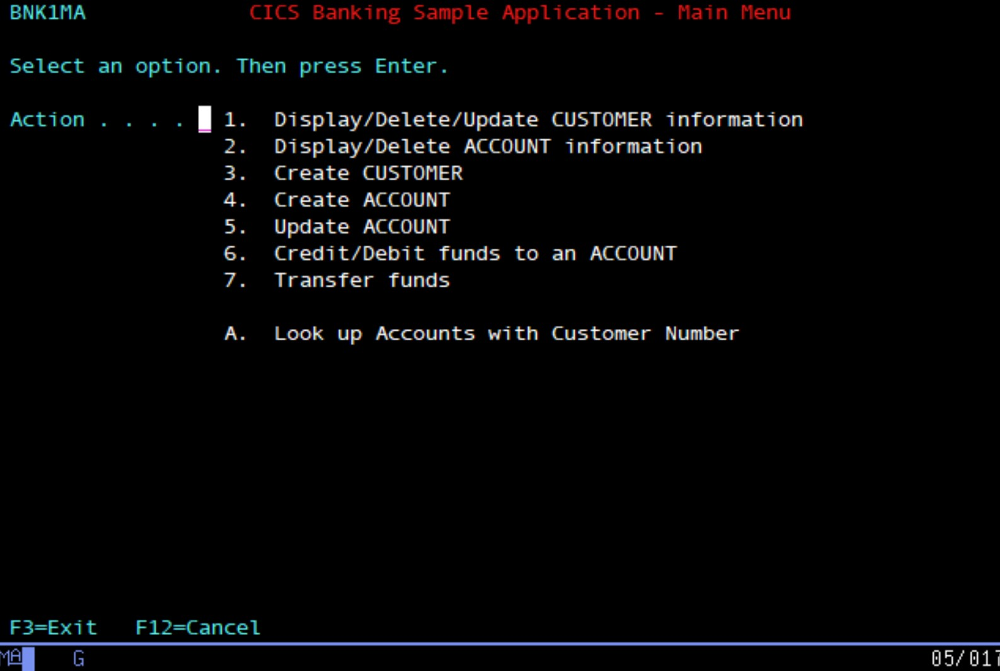
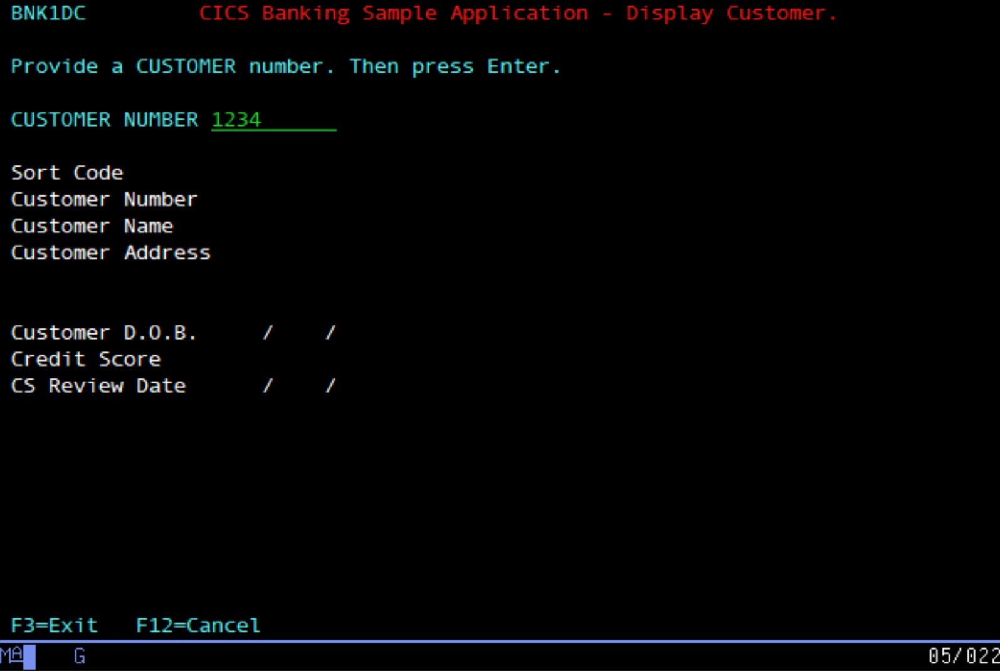
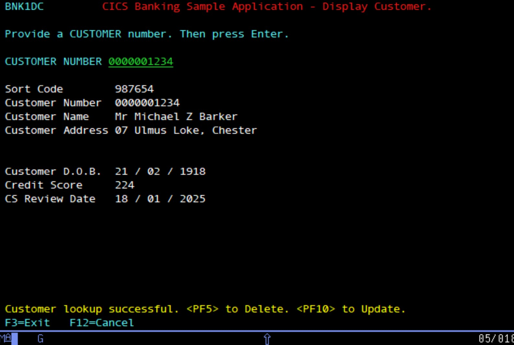

# CBSA base/COBOL Installation Instructions

## 

## Introduction:

There are multiple parts to the CICS Banking Sample Application (CBSA).
There is the base/COBOL installation - which needs to be installed as a
minimum. Then there are additional, optional, installation instructions
for the Carbon React UI and the Payment and Customer Services interfaces.

This document is the base/COBOL installation. It assumes that the
installer already has:

-   a CICS region (running CICS TS 5.4 or greater)

-   a Db2 subsystem (v12 or greater)

-   a zOS Connect server.

These instructions detail the steps required to:

1.  Download the base JCL, source code, and maps.

2.  Compile/assemble, bind and link edit the source code to create the
    base load modules.

3.  Create all of the CICS CSD file definitions (to define all of the
    transactions, programs, and CICS resources for CBSA).

4.  Define all of the Db2 artefacts.

5.  Create and populate all of the underlying VSAM files and also
    populate the Db2 tables with data.

6.  Make the necessary changes to your CICS region start up JCL and zOS
    Connect server.xml file.

At the end, your CICS region should be capable of successfully executing
CBSA transactions.

## 

## Setting up libraries on the host machine and downloading data into them from GitHub:

The CBSA GitHub repo can be found at:

[Github](https://github.com/cicsdev/cics-banking-sample-application-cbsa)

**Assumptions:**

There are some assumptions within this document, these are:

1. That a CICS region and the underlying libraries for that region
   are already installed in the host environment. Within this document,
   the CICS region is called **CICSTS56.**

2. That a Db2 subsystem is available in the host environment. The Db2
   subsystem used, in this document, is called **DBCG**.

3. If the restful API or the Payment and/or the Customer Services
   interfaces are required, it is assumed that a zOS Connect Server is
   already installed and available. For the sake of illustration, the one
   we use is installed in USS at:

`/var/zosconnect/v3r0/servers/defaultServer/resources/zosconnect`

 (The z/OS Connect *server.xml* file for your own installation may
 be installed in a different location).

**NOTE 1** - The installation illustrated in this document replaces the
'default' zOS Connect **server.xml** with one which utilises the port
numbers ***30701*** (HTTP) and ***30702*** (HTTPS) for the CBSA RESTful
API. Should these port numbers not be appropriate in your host
environment then they may be changed in the **server.xml** member after
downloading it from the repo folder:

> [/etc/install/base/zosconnectserver](/etc/install/base/zosconnectserver)

(see [Installation instructions](#installation-instructions) below for
more information).

**NOTE 2** - The last line in **server.xml** references the connection
between the z/OS Connect server and the CICSTS56 CICS system and it
utilises port ***30709***:

`<zosconnect_cicsIpicConnection id="cicsConn"
host="localhost" port="30709" />`

If the 30709 port number needs to be changed, edit the **server.xml**
file and then edit the CSD definition for TCPIP Service definition
(ZOSEE), as shown below, which is provided in member BANK, after
downloading it from the repo folder:

> [/etc/install/base/installjcl](/etc/install/base/installjcl)

>

>(see [Installation instructions](#installation-instructions) below for
more information)

### Installation instructions:

1. Create a PDSE on your host machine. In our example, we called it **CBSA.JCL.INSTALL** (this
should be capable of holding JCL members). It must be Fixed Block and with a record length of 80. Here is the dataset information that we used:

>

Then copy all .jcl files and the .csd file from the [installjcl](../installjcl) directory folder in
the repo, into the PDSE **CBSA.JCL.INSTALL**

This PDSE contains a set of jobs, which are used to create the necessary
libraries and perform necessary set up.

2. On the host machine, execute job CBSA.JCL.INSTALL(**CRELIBS**).

This job creates the following additional empty PDSE/LIBRARYs on the
host machine (which are all required later on):
>
>| PDSE/Library              | Description                                |
>| ------------              | -----------                                |
>| CBSA.DB2.JCL.INSTALL      | Will contain JCL members to set up DB2.    |       
>| CBSA.CICSBSA.BUILDJCL     | Will contain the jobs (JCL) to compile all of the source code in CBSA. |
>| CBSA.CICSBSA.LOADLIB      | Will contain the LOAD modules which will be used by the CICS region running CBSA (these modules are created later during compilation).|
>| CBSA.CICSBSA.DBRM         | Will contain the Db2 DBRM modules (which are generated by the bind).|
>| CBSA.CICSBSA.LKED         | Will contain the Link Edit source entries.|
>| CBSA.CICSBSA.BMS          | Will contain the BMS (map) source code modules.|
>| CBSA.CICSBSA.ASM          | Will contain Assembler source modules required to assemble DFHNCOPT.|
>| CBSA.CICSBSA.CBSAMOD      | Will contain the output from the COBOL compilation.|
>| CBSA.CICSBSA.COBOL        | Will contain the COBOL source code.|
>| CBSA.CICSBSA.DSECT        | Will contain the copylib that is used by the COBOL programs and installation compile jobs (this folder contains Mapset DSECTs too).|

3. Once the CBSA.JCL.INSTALL(**CRELIBS**) job has completed and has created
the above libraries, it will be necessary to copy the content from each
of the following GitHub folders into each respective host library.

>| GitHub folder content                                                         | Host LIBRARY                                |
>| ---------------------                                                         | ------------                                |
>| [/etc/install/base/db2jcl](../db2jcl)                                         | **CBSA.DB2.JCL.INSTALL**                    | 
>| [/etc/install/base/buildjcl](../buildjcl)                                     | **CBSA.CICSBSA.BUILDJCL**                   |
>| [/etc/install/base/linkeditjcl](../linkeditjcl)                               | **CBSA.CICSBSA.LKED**                       |    
>| [/src/base/bms_src](/src/base/bms_src)                                        | **CBSA.CICSBSA.BMS**                        |  
>| [/src/base/asm_src](/src/base/asm_src)                                        | **CBSA.CICSBSA.ASM**                        |
>| [/src/base/cobol_src](/src/base/cobol_src)                                    | **CBSA.CICSBSA.COBOL**                      |
>| [/src/base/cobol_copy](/src/base/cobol_copy)                                  | **CBSA.CICSBSA.DSECT**                      |

>| GitHub folder content                                                         | USS Location on the host                    |
>| ---------------------                                                         | ------------------------                    |
>| [/etc/install/base/aarfiles](/etc/install/base/aarfiles)                      | Copy all .aar files into the location of the zOS Connect **apis** folder in USS, in our case it is /var/zosconnect/v3r0/servers/defaultServer/resources/zosconnect/**apis**/ (**Note** - if your zOS Connect server runs from a different location in USS, copy the content of the GitHub folder into the location of your own server's **apis** folder). |
>| [/etc/install/base/sarfiles](/etc/install/base/sarfiles)                      | Copy all .sar files into the location of the zOS Connect **services** folder in USS, in our case it is /var/zosconnect/v3r0/servers/defaultServer/resources/zosconnect/**services**/ (**Note** - if  your zOS Connect server runs from a different location in USS, copy the content of GitHub folder into the location of your own server's **services** folder). |

## Setting up the Db2 components (STORGROUPS, TABLESPACES, TABLES, INDEXES):

The following job creates the ACCOUNT, PROCTRAN and CONTROL table Db2
components used by CBSA. The Db2 ACCOUNT table holds the data for every
account at the bank. The PROCTRAN table holds information about
successfully processed banking transactions and the CONTROL table is
utilised to store the last account number in use.

**Note** - You may wish to tailor the following job for your Db2
subsystem and site standards. At the moment, "as is", it assumes an
existing Db2 subsystem called **DBCG,** and all of the tables are
prefixed **IBMUSER** to differentiate them from others that you may have
with similar names.

1. Execute job CBSA.DB2.JCL.INSTALL(**INSTDB2**). This creates the Db2
artefacts e.g. STORGROUPS, TABLESPACES, TABLES and INDEXES (note at this
time the ACCOUNT, PROCTRAN and CONTROL tables, required by CBSA, have no
data on them yet - data population is performed in [Create the VSAM
files and populate the Db2 tables with
data.](#create-the-vsam-files-and-populate-the-db2-tables-with-data)).

## Compile/assemble, linkedit and bind the source code modules and BMS maps. 

CBSA.CICSBSA.BUILDJCL(DEFAULT) contains default values for the high-level qualifiers for CICS, DB2, COBOL, Language Environment and CBSA itself. Change these if necessary.

1. Execute job CBSA.CICSBSA.BUILDJCL(**COMPALL**) to compile all of the
source code.

2. Execute job CBSA.DB2.JCL.INSTALL(**DB2BIND**) to BIND the programs to
Db2.

>> All load modules are created in CBSA.CICSBSA.LOADLIB.

## 

## Create the VSAM files and populate the Db2 tables with data:

1. Execute job CBSA.JCL.INSTALL(**BANKDATA**) to create the ABNDFILE and
CUSTOMER VSAM files and to execute program BANKDATA which populates the
ACCOUNT and CONTROL Db2 tables with data (note the PROCTRAN table has no
data in it to start with).

## 

## Set up the CICS region, SIT parameters and the DFHCSD used to contain all of the CBSA definitions:

1. Execute job CBSA.JCL.INSTALL(**HBANKCSD**) to update the DFHCSD with the
CBSA definitions and add the CSD GROUP(BANK) into a **LIST** called
**CICSTS56** (which is used in the SIT parms for the CICS region).

>> **NOTE:** This job updates an existing CSD called DFH560.CICS.DFHCSD and
>> adds the CBSA resource definitions to it. You may need to amend job
>> HBANKCSD with the name of your CSD. All of the CSD definitions needed
>> for CBSA are located in CBSA.JCL.INSTALL(BANK).
>> You may also wish to edit the BANK member if you should need to use a
>> different port number for the IPIC connection between the CICS region
>> and the zOS Connect server (ZOSEE) - we used port number 30709).
>> Verify that the name of the DB2CONN matches your requirements, and that it connects to the correct Db2 subsystem.

2. Check job CBSA.JCL.INSTALL(**CICSTS56**), this is the startup procedure
for the CICS region that we are using. You will have you own JCL or PROC
to start up your own CICS region. You may need to extrapolate
information from this member to include into your own CICS region
startup JCL. The most pertinent things are:

>> -   Inclusion of the CBSA.CICSBSA.LOADLIB in the DFHRPL
>> 
>> -   Inclusion of the DFHCSD containing the CBSA definitions created
>>     previously

3. You may need to extrapolate SIT parm information from
CBSA.JCL.INSTALL(DFH\$SIP1) and include this in your own region. The
most pertinent things from the SIT are:

>> DB2CONN=YES
>> 
>> GRPLIST=(XYZLIST,**CICSTS56**) - ensure that you include the CICSTS56
>> LIST, created above, into your GRPLIST.

## 

## Make RACF and USS security changes 

***Some RACF changes for Db2 authorisation and the zOS Connect server
will likely be required.***

1. Please review the content of member CBSA.JCL.INSTALL(**RACF001**). This
makes the RACF changes to ensure that the user **IBMUSER** utilised
within our CICS environment has the correct level of access to the Db2
subsystem **DBCG**. Similar RACF authorisations will need to be made to
the user and Db2 subsystem in use in your environment.

2. Please also review the content of member CBSA.JCL.INSTALL(**ZOSCSEC**).
This makes changes to the security required for zOS Connect. A
similar authorisation will need to be made to the location of the apis
and services folder in use by your own zOS Connect server (the apis
and services folder contains the aarfile and sarfiles respectively).

***Stop and Restart the CICS region.***

1. In order to pick up the changes to the SIT parms and the new CSD
definitions for CBSA, it is necessary to stop and restart your CICS
region at this point. The CICS region should be COLD started, to ensure
that all of the changes are pulled in.

***Stop and Restart the zOS Connect Server.***

1. In order to pick up the changes to the z/OS Connect Server (which
may already be running), it is necessary to stop and restart your zOS
Connect server at this point.

## 

## Validating that the installation has worked:

***Checking the CUSTOMER VSAM KSDS:***

1. Logon/sign in to your CICS region. Clear the screen, Type OMEN and
you should be presented with the CBSA MAIN MENU:

2. Select option 1 (Display/Delete/Update CUSTOMER information) from
the main menu:

Then enter a Customer Number:

If all is well, the details for that particular customer should be
returned:

(this validates that customer information held on the CUSTOMER KSDS file
has been populated correctly).

***Checking the ACCOUNT data (Db2):***

3. Go back to the CBSA main menu (pf3):

And from here select option 2 (Display/Delete ACCOUNT information):

The account number field should be 8 bytes long. Supply an account
number, for example:

And this should return some data:

If data is displayed, this validates that the Db2 ACCOUNT table has been
correctly populated.

***\
\
Checking the zOS Connect API:***

4. Confirm that the zOS Connect server has been restarted and is
executing.

5. Go to a web browser and put in this URL:

> [http://*your-host-name*:*your-port-number*/inqaccz/enquiry/42](http://your-host-name:your%20port-number/inqaccz/enquiry/42)

6. This should return something similar to this (enquiry on account
42):

If data is not returned, then check the port number and status of the
z/OS Connect server. If these are OK, check in the CICS region (using
the **CEMT I TCPIPS(ZOSEE)** command) that there is a TCPIP Service
called **ZOSEE** and that it has been installed and that the TCPIP
Service is Open. You should see something like this:

The above TCPIP Service uses port 30709 in our set up (yours may be
different) - this is the connection between the zOS Connect server
and the CICS region.

Finally, check the zOS Connect Server logs to ensure that the API
archive files (the aars), and the service archive files (the sars) were
all installed successfully.
