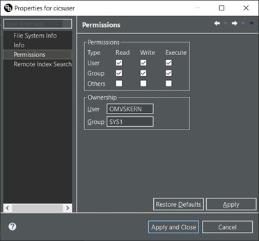
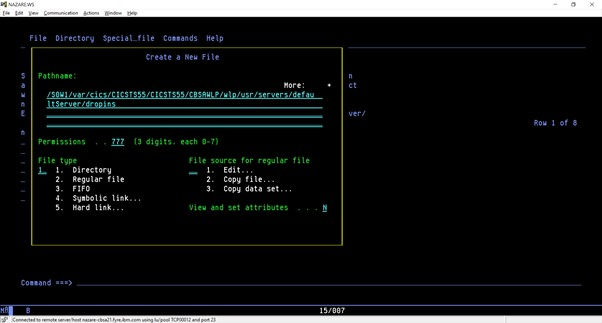
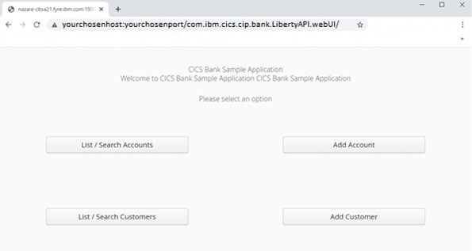

# Liberty UI installation/deployment guide

## Introduction:

> There are multiple parts to the CICS Bank Sample Application (CBSA).
> The base/COBOL installation needs to be installed first, to define all
> of the necessary files, data etc.
>
> This document is for the Liberty UI deployment/installation. It
> assumes that the installer already has:

-   a CICS region (running CICS TS 5.4 or greater)

-   a Db2 subsystem (v12 or greater)

-   the CBSA base/COBOL installed in the CICS region already

> These instructions detail the steps required to:

1.  Create and authorise a JVM profile.

2.  Define the JVM CICS resources.

3.  Create a dropins directory.

4.  Edit the server.xml with the appropriate properties.

5.  Deploy the Liberty UI application.

### Assumptions: 

-   These instructions utilise CICS TS 5.5 and therefore all directory
    names used etc. are based around that, they will need to be
    amended accordingly for different versions of CICS.

-   The hostname, port number, userid and CICS TS version may be
    different when you install/deploy into your own environment. We
    have highlighted, within these instructions, where such things may
    need to be amended accordingly.

-   The User ID running the CICS region that we are using throughout
    this document is called **CICSUSER**. You may wish to utilise a
    different User ID and should amend references to CICSUSER
    accordingly.

## 
 
## Update the CICSUSER Userid:

If you have already installed the Liberty UI, you can skip this step.

> It may be necessary to update the USERID being utilised in your
> environment to allow the USERID running the CICS region to have access
> to everything it needs. In this example, the USER running the CICS
> region is called **CICSUSER**. It needs to have access to the "HOME"
> directory.

1.  Issue the commands from the TSO Shell.

> **LISTUSER CICSUSER OMVS NORACF**
>
> This returns:
>
>> USER=CICSUSER
>>
>> OMVS INFORMATION
>>
>> \-\-\-\-\-\-\-\-\-\-\-\-\-\-\--
>>
>> UID= 0000990018
>>
>> HOME= /u
>>
>> PROGRAM= /bin/sh
>>
>> CPUTIMEMAX= NONE
>>
>> ASSIZEMAX= NONE
>>
>> FILEPROCMAX= NONE
>>
>> PROCUSERMAX= NONE
>>
>> THREADSMAX= NONE
>>
>> MMAPAREAMAX= NONE

2.  The "HOME" directory is set to /u and the USERID running the CICS
    region (CICSUSER) may not have access to that. You fix that by
    issuing the following:

> ALTUSER CICSUSER OMVS(HOME(/u/cicsuser))
>
> This fixes it, but that directory doesn't exist yet.

3.  Create a new folder for /u/cicsuser in Remote Systems Explorer.

> This may cause permissions problems. So amend the permissions as
> follows:
>
> 
>
>
> And then change the owner:
>
> chown CICSUSER .

## 

## Create a JVM server:
If you have already installed the Liberty UI, you can skip this step.

> We need a JVMSERVER resource.

1.  Create a new directory called

> /var/cics/JVMProfiles/

2.  Copy the CICS supplied JVM profile called DFHWLP in to this new
    directory. In this case, copy from the following into the new **JVM Profiles** directory:

> /usr/lpp/cicsts/cicsts55/JVMProfiles/DFHWLP.jvmprofile

3.  To utilise a JVMSERVER within CICS, you will we need a JVMPROFILEDIR
    SIT parameter in the CICS. Specify the following in the CICS
    region SIT parameters:

> JVMPROFILEDIR=/var/cics/JVMProfiles/

4.  The copied DFHWLP.jvmprofile will need to be edited:

> 1.  Ensure that JAVA_HOME is set to the appropriate level of java (in
      our case J8.0_64):
> 
>> JAVA_HOME=/usr/lpp/java/J8.0_64/
>
>2.  Ensure that autoconfigure is set to true:

>> -Dcom.ibm.cics.jvmserver.wlp.autoconfigure=true

>3.  The timeout value should be set to a large value.:

>> -Dcom.ibm.cics.jvmserver.controller.timeout=900000
>>
>> **Please note:** that if the execution host machine is not very
>> powerful, that Java may take a significant time to start.

>4.  Add the following to the JVM profile to add support for DB2:

>> -Dcom.ibm.cics.jvmserver.wlp.jdbc.driver.location=/usr/lpp/db2c10/jdbc/
>>
>> -Dcom.ibm.cics.jvmserver.wlp.server.http.**port=19080**
>>
>> **Please note**: You should verify the location of the JDBC driver and
>> amend the location (above) according to your own site installation
>> location.
>> Port **19080** is used in these instructions, you may wish to utilise a
>> different port number and should specify your chosen port number
>> (above) instead.

>5.  WORK_DIR must be set to a directory that the CICS region userid
    "CICSUSER" has access to. For example:

>> /u/cicsuser/
## 

## CICS Resources:

1.  CSD GROUP CBSAWLP contains a JVMSERVER called CBSAWLP

> CEDA DEFINE GROUP(CBSAWLP) JVMSERVER(CBSAWLP) JVMPROFILE(DFHWLP)
>
> This is JVMSERVER DFHWLP from DFHWLP copied and renamed.
>
> CEDA DEFINE GROUP(CBSAWLP) URIMAP(CBSAWLP) USAGE(JVMSERVER) HOST(\*)
> PORT(**19080**) PATH(\*) USERID(CICSUSER)
>
> Amend the above command accordingly, to represent your chosen port
> number and Userid.

2.  Add the group CBSAWLP to a list installed on a cold start, for
    example CICSTS55.

3.  Add the group DFH\$WU to a list installed on a cold start.

4.  Restart the CICS region with a *cold* or *initial* start.

5.  Create and install this and it will create a JVM server. It may take
    a few minutes to become enabled.

> This will create a server.xml file in
>
> /u/cicsuser/CICSTS55/CICSTS55/CBSAWLP/wlp/usr/servers/defaultServer/

## 

## Create a "dropins" directory:

1.  In UNIX Systems Services create a directory called "dropins" in the
    Liberty workspace.

> /u/cicsuser/CICSTS55/CICSTS55/CBSAWLP/wlp/usr/servers/defaultServer/defaultServer/dropins
>
> 
>

## 

## Edit server.xml:

1.  Edit server.xml so that the attribute dropinsEnabled is set to true.

> \<applicationMonitor dropins=\"dropins\" dropinsEnabled=\"true\"
> pollingRate=\"5s\" updateTrigger=\"disabled\"/\>

2.  Add the following attribute to the **properties.db2.jcc** element:

> currentSchema=\"IBMUSER\"
>
> So it now looks like this:
>
> \<properties.db2.jcc driverType=\"2\" currentSchema=\"IBMUSER\"/\>
>
> **Note** -- "IBMUSER" is utilised in this example and relates to the
> user id assigned to the Db2 environment setup.

3.  Within the \<featureManager\> tag, add the following lines:

> \<feature\>jaxrs-1.1\</feature\>
>
> \<feature\>json-1.0\</feature\>

## 

## Deploying the application:

You need Maven installed on your laptop. Maven is a dependency
management tool which is provided by Apache.

> <https://maven.apache.org/install.html>

Start the command prompt.

Change directory to the cics-banking-sample-application-cbsa/src/webui/ folder

At this point we are missing the JARs for the IBM Record Generator(IRG) and the IBM JZOS toolkit. 

You will need to go to the following URL to download the Record Generator:

> https://ibm.github.io/mainframe-downloads/IBM-Record-Generator-for-Java.html

Issue the following command from the command line:

mvn install:install-file -Dfile="*download location*/ibm-recgen/ibm-recgen.jar" -DgroupId=ibm.recgen -DartifactId=ibm-recgen -Dversion=1.0.0 -Dpackaging=jar

Then you need to goto your installation of Java, typically this can be found in:

> /usr/lpp/java/lib/ext

Issue the following command from the command line:

> mvn install:install-file -Dfile="*download location*/ibmjzos.jar" -DgroupId=jzos -DartifactId=ibmjzos -Dversion=1.0.0 -Dpackaging=jar

Issue the following Maven command:

> mvn clean package

## 

## Export to dropins directory:

Copy the war file from the two target directories into the dropins directory. 

## 

## Checking the Liberty UI:

> Access the Liberty UI using the following URL, you should utilise the
> hostname and port number that you have assigned:
>
> [http://*your-chosen-host-name*:*your-chosen-port-number*/com.ibm.cics.cip.bank.LibertyAPI.webUI/](http://your-chosen-host-name:your-chosen-port-number/com.ibm.cics.cip.bank.LibertyAPI.webUI/)
>
> **Please note** that on lower powered machines, it may take up
> to 5 minutes for the JVM server to restart.
>
> Once the JVM server has restarted you should be presented with the
> CBSA Liberty UI main menu.
>
> CICS Bank Sample Application Main Menu:
>
> 
>
>
> For a detailed description of the functionality provided by this
> interface please refer to the GitHub repo:
>
> cicsdev/cics-banking-sample-application-cbsa/etc/usage/libertyUI/doc
