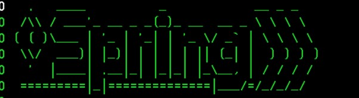

# CBSA Deploying the Payment and Customer Services Spring Boot apps

### Introduction:

CBSA has two Spring Boot applications provided, for the Customer
Services and Payment interfaces. These applications allow easy use of
the RESTful API in CBSA with simple clean interfaces. There are multiple
steps (listed below) that need to be actioned in order to get them up
and running.

These instructions detail the steps required to:

1.  Set up the port for the zOS Connect server.

2.  Install Maven.

3.  Package up the application with Maven.

4.  Copy the WAR file to the apps directory.

5.  Update the JVM Server.

6.  Access the applications.

### Assumptions: 

-   A CICS region (running CIC TS 5.4 or later) is available, and the
    CBSA base/COBOL installation has been performed.

-   A Db2 subsystem (v12 or greater) is available.

-   A zOS Connect server is available - set up as part of the
    base/COBOL install.

-   A Liberty JVM is running inside of the CICS region - this is set up
    as part of the Liberty UI installation process.

-   Java 8 or later

-   Maven is utilised during the deployment of the apps -
    instructions are provided below.

### CICS Bank Sample Application Architecture:

For architecture information please refer to the GitHub repo:

> cicsdev/cics-banking-sample-application-cbsa/doc

##
 
## Changing the port to match z/OS Connect:

The Spring Boot applications run inside a WebSphere Liberty Profile JVM
server inside CICS, but also communicate with z/OS Connect. It is
important to make sure that the connection information to the zOS
Connect server is correct. As a default, these are set to port 30701
and host localhost, if you utilised a different port number or hostname
during the zOS Connect setup (as part of the base/COBOL installation)
then please substitute the default values with yours.

Should you need to change these, they are configured in the following files, which can be found on the repo at:

> cicsdev/cics-banking-sample-application-cbsa/src/Z-OS-Connect-Customer-Services-Interface/src/main/java/com/ibm/cics/cip/bank/springboot/customerservices/**ConnectionInfo.java**

> cicsdev/cics-banking-sample-application-cbsa/src/Z-OS-Connect-Payment-Interface/src/main/java/com/ibm/cics/cip/bank/springboot/paymentinterface/**ConnectionInfo.java**

Both need to be changed and both currently contain the following lines.

private static int port = 30701;

private static String address = \"localhost\";

##
 
## Maven:

You need Maven installed on your laptop. Maven is a dependency
management tool which is provided by Apache.

> <https://maven.apache.org/install.html>

Start the command prompt.

Change directory to the Z-OS-Connect-Customer-Services-Interface folder in cics-banking-sample-application-cbsa/src/

This creates a folder called target, and inside of target is a .war file.

At this point we are missing a Java Archive file for the jZOS Toolkit. 

You need to goto your installation of java, typically this can be found in:

> /usr/lpp/java/lib/ext

Copy the "ibmjzos.jar" to a location on your workstation and make a note of it.

Issue the following command from the command line:

> mvn install:install-file -Dfile="*download location*/ibmjzos.jar" -DgroupId=jzos -DartifactId=ibmjzos -Dversion=1.0.0 -Dpackaging=jar

Issue the following Maven command:

> mvn clean package

This creates a folder called target, and inside of target is a .war file.

Change directory to the Z-OS-Connect-Payment-Interface folder in cics-banking-sample-application-cbsa/src/

Issue the following Maven command:

> mvn clean package

## 

## Export to apps directory:

Copy the war file from the two target directories into the apps directory. 

##

## Updating the JVM server:

The JVM server, provided in the CICS region, may need to be updated to
provide more time for the application to start. The JVM profile lives in
the JVMPROFILEDIR specified on CICS start-up, in this example it is this
one:

> /S0W1/var/cics/JVMProfiles/DFHWLP.jvmprofile

At the bottom, add the following timeout overrides.

> -Dcom.ibm.cics.jvmserver.controller.timeout=900000

> -Dcom.ibm.cics.jvmserver.wlp.bundlepart.timeout=900000

Then update the server.xml which controls the operation of the WebSphere
Liberty Application Server. In this example, it is here, and this is an
ASCII file. You need to use 3.17 (the Unix Directory List Facility) and
the EA (Edit Ascii File) option to edit it.

> /u/cicsuser/CICSTS56/CBSAWLP/wlp/usr/servers/defaultServer/server.xml

Add the two applications by adding these lines:

>    \<webApplication location=\"customerservices-1.0.war\"/\>
>    \<webApplication location=\"paymentinterface-1.1.war\"/\>

Restart the JVM server to allow these new changes to come into effect.

The WAR files have installed and now we must wait for the Spring Boot
applications to start. Check the *messages.log* file, in this example
these are found in:

> /u/cicsuser/CICSTS56/CBSAWLP/wlp/usr/servers/defaultServer/logs
>
> 

This is a sign that things are working, and the applications are
starting.

Message CWWKZ0001I is issued several minutes later at which point you
can use the applications.

> Root WebApplicationContext: initialization completed in 180700 ms
>
> Root WebApplicationContext: initialization completed in 180395 ms

## 

## Access to the application/interfaces:

### The Customer Service interface
To access the Customer Services interface utilise the following URL,
note that you will need to amend the URL in this example to reflect your
own hostname and port number:

> <http://your-chosen-host-name:19080/customerservices-1.0/>

**NOTE** - Port number 19080 is the JVM Server port number which was
allocated as part of the Liberty UI installation process. If you elected
to use a different port number, you should substitute it with your own
one.

A user guide for the Customer Services interface can be found in the
repo:

> cicsdev/cics-banking-sample-application-cbsa/etc/usage/springBoot/doc

### The Payment interface
Access to the Payment interface is via the following URL, note that you
will need to amend the URL in this example to reflect your own hostname
and port number:

> <http://your-chosen-host-name:19080/paymentinterface-1.1/>

**NOTE** - Port number 19080 is the JVM Server port number which was
allocated as part of the Liberty UI installation process. If you elected
to use a different port number, you should substitute it with your own
one.

A user guide for the Payment interface can be found in the
repo:

> cicsdev/cics-banking-sample-application-cbsa/etc/usage/springBoot/doc.
