# CICS Bank Sample Application (CBSA) Liberty UI User Guide 

## 

## CICS Bank Sample Application Liberty UI Architecture:

For architecture information please refer to the GitHub repo:

cicsdev/cics-banking-sample-application-cbsa/doc

## Accessing the Liberty UI:

Access to the Liberty UI is via a web browser. The exact URL will depend
upon the host name and the port number chosen during installation. It
will look something like this:

[http://*your-allocated-host-name*:*your-port-number*/com.ibm.cics.cip.bank.LibertyAPI.webUI/](http://your-allocated-host-name:your-port-number/webUI/)

#### CICS Bank Sample Application Main Menu:

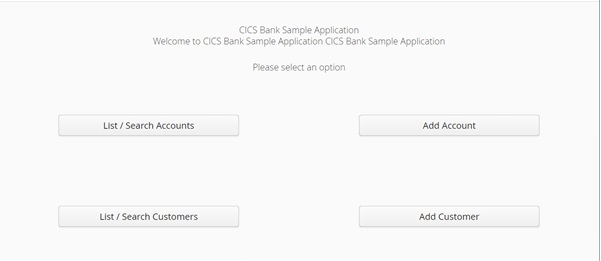

The Liberty UI main menu is the start point for utilising all
functionality from this interface. The Liberty UI contains similar
functionality to the BMS offering, however it should be noted that there
is not a 1-1 mapping. The Liberty UI contains some functionality which
the BMS offering does not. To utilise a specific function click on the
associated button.

#### List / Search Accounts:

After clicking the List / Search Account button you should get the
following:

This option displays all of the accounts starting from the first
account.

From here you can search by a specific account number, customer number
or by balance e.g. all accounts with a balance greater than or less than
a value set by the balance slider.

You can delete an account, by clicking the associated DELETE button on
the right.

You can EDIT an account, by clicking the associated EDIT button on the
right.

This example shows the first of 500 pages, click -\> to go up a page,
\<- to go down a page, and \<\<\<- to go to the first page.

#### Search for a specific customer's accounts:

This is done from the List / Search account screen. To search for a
specific customer (e.g. customer 1), enter the customer number in to the
box and click the "Search" button. The following is returned:

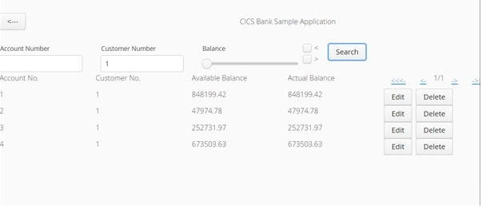

In this example, customer number 1 has four accounts associated with it.

You may delete or edit/update an account by clicking the associated
button to the right of it.

The following shows an edit to account number 1. This is returned:

When editing/updating an account you cannot change the account number,
customer number, sort code or balance. But you can change the type of
account by using the dropdown box, the interest rate (which may have up
to 2 decimal places) or the overdraft limit (which must be a positive
integer).

After making your changes, click on the "Edit Account" button to save
the changes:

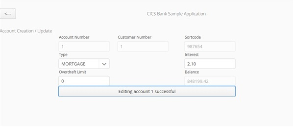

If the change was successful, the text within the button gets amended
accordingly.

If you do not wish to save the changes, click on the back arrow to exit
the screen, and return to the main menu:

#### Adding an account:

Customers are limited to a maximum of TEN accounts.

From the main menu:

click Add Account:

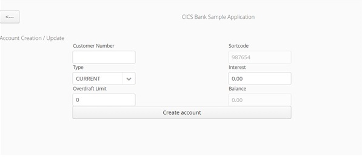

You MUST specify the customer number of the customer to whom the account
belongs. You can:

-   change the account type, which will be pre-filled with CURRENT,
    using the drop down list.

-   change the overdraft limit and the interest rate which have the same
    restrictions as before.

Click "Create account" to create the account:

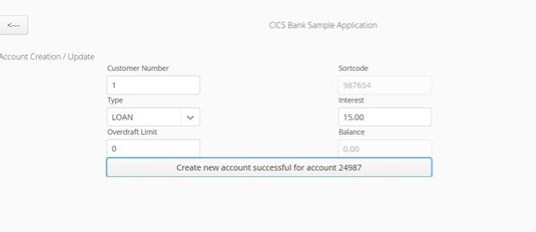

If the account creation was successful, the text within the button gets
amended with the account number which was allocated, in this case
account 24987.

Click on the back arrow at the top left to return to the main menu.

#### List / Search Customers:

From the main menu:

click List/Search Customers on the bottom left:

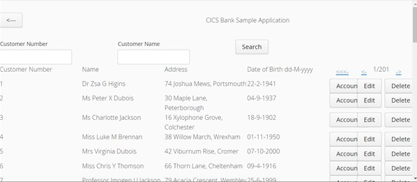

You may search for customers by customer number or by Customer Name.

For example, to search for all customers who have the title Dr, supply
"Dr" in the Customer Name box and click Search:

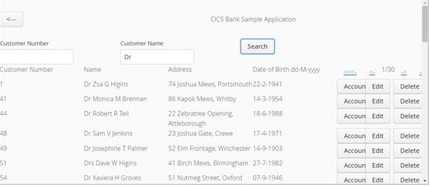

Here you can see that there are 30 pages of customers which match the
search criteria.

You may click on the DELETE button to delete the chosen customer.
Deleting a customer also deletes all of their accounts.

You can click on the ACCOUNTS button to view the accounts owned by that
customer. In this example these are the accounts owned by customer 1:

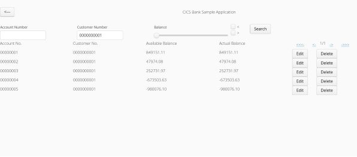

And from here you can edit or delete accounts.

To return to the main menu click the back arrow:

#### Editing a customer's details:

From the main menu:

click List/Search Customers on the bottom left:

Then click the associated Edit button next to the customer you wish to
change:

You can only change the customer's name and address.

In this example Dr Zsa G Higins moved to 74A Joshua Mews:

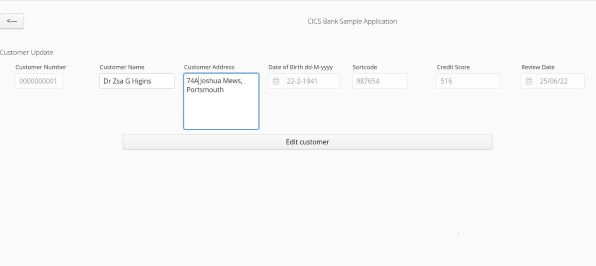

Click the Edit customer button to save the changes:

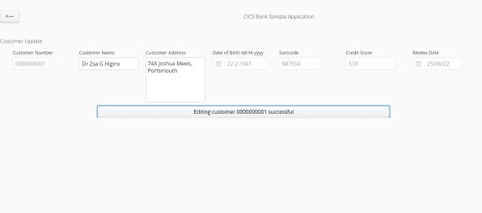

Click the back arrow to return to the main menu:

#### Adding a new customer:

From the main menu:

click Add Customer:

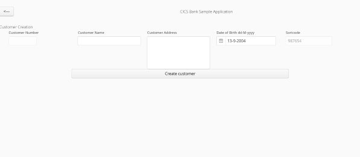

You must fill in name and address. Date of birth is pre-filled so as to
make today the customer's 18th birthday (but can then be changed).
Customers cannot be younger than 18 or older than 120.

Click the Create customer button to create the customer:

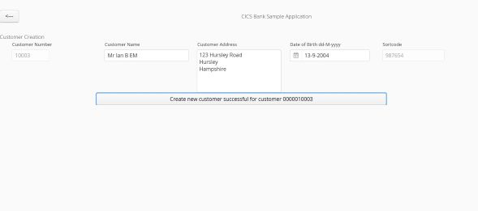

The new customer number is listed in the button text. This customer will
have no accounts yet.
