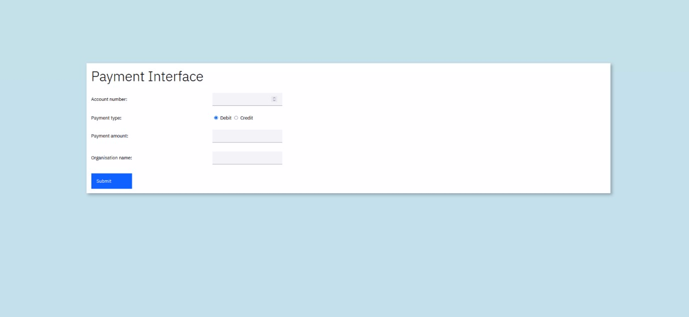
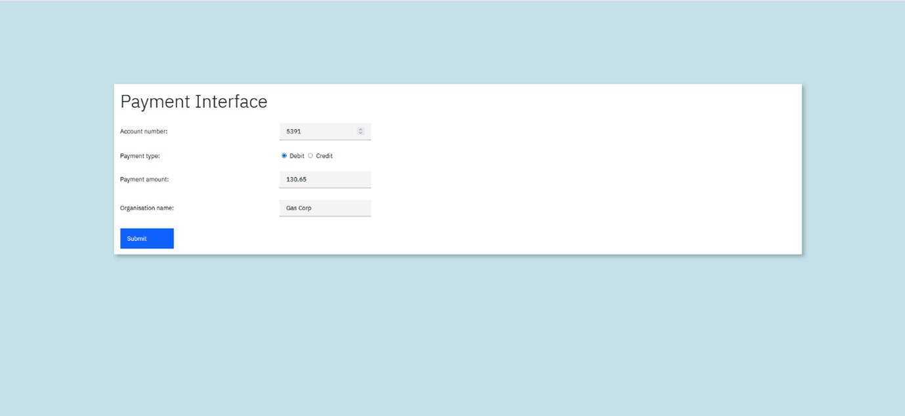
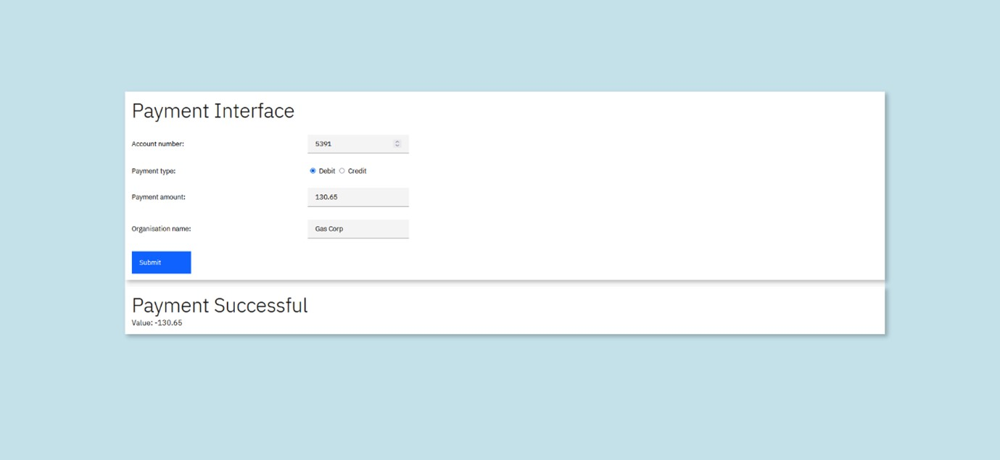
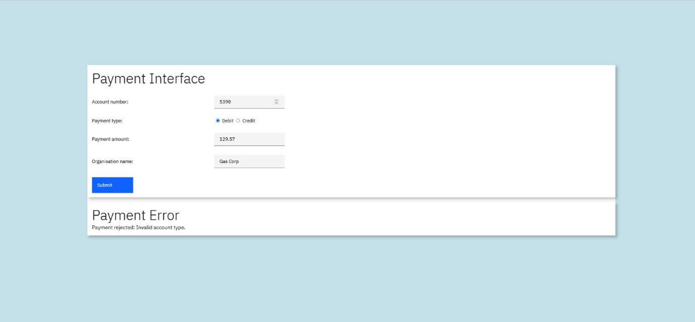
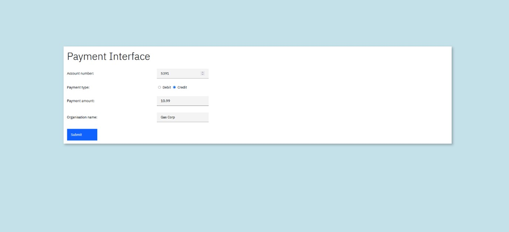

# The Payment Interface User Guide

### Introduction:

The Payment interface is a Spring Boot application, which can drive
back-end banking data, via a series of RESTful API calls, made to a zOS
Connect server, which in turn, routes the requests to a CICS region.

Please refer to the GitHub repo:

> cicsdev/cics-banking-sample-application-cbsa/etc/usage/springBoot/doc

for the CBSA RESTful API guide.

### The business justification/usage scenario for the Payment interface:

The Payment interface will be given to trusted companies to enable them
to process payments for their goods and services from accounts held in
CBSA.

Conceptually, the Payment interface is similar to a debit/credit card
machine that businesses use, but instead of swiping a card, the business
has access to take payments or make refunds directly from their
customer's bank accounts via the Payment interface.

The associated RESTful APIs can all be utilised directly without using
the Payment interface, and could, if required, be integrated with other
applications. The Payment interface, and the Spring Boot source code, has
been provided to allow the RESTful API to be used straight from the box.

The functionality in the Payment interface, mimics functions provided in
the BMS and Liberty UI interfaces (as used by the Bank Teller).

### Accessing the Payment Interface:

It can be accessed via a URL structured as follows:

[http://your-host-name:your-host-port-number/paymentinterface-1.1/](http://your-host-name:your-host-port-number/paymentinterface-1.1/)

### 

(\* as part of the installation process, you will have previously assigned your own hostname and port number for the Payment interface to utilise).

### The Payment landing page:

The Payment interface is comprised of one page, the landing page. From
here a company can request money (payment) for its goods and services
from accounts at CBSA Bank. Or a company can use this interface to issue
a refund to an account within CBSA.

### *Requesting a Payment:*

The company, in this example "Gas Corp", can take a payment, by
supplying the account number (of its customer) and selecting the "Debit"
radio button and then supplying the amount, and the requesting company's
name:

When "Submit" is clicked the supplied data is validated. Should
something fail a validation check, a suitable message will be returned
(see below for an example).

Assuming that the validation checks pass, a confirmation message will be
returned:

In this example, account 5391 relates to an "ISA account" held at the
bank and the payment to Gas Corp for £130.65 was successful.

If an attempt is made to take a payment from an account which has an
account type of MORTGAGE or LOAN, the request will be rejected:

In the above example, account 5390 is a LOAN account and that is why the
payment attempt has been unsuccessful.

### *Making a refund:*

The company, in this example "Gas Corp", can also use the Payment
interface to refund money to an account held in CBSA. They do so by
selecting the "Credit" radio button:

Then clicking "Submit":

